# Manuel d'utilisation de RedCall

## Présentation

RedCall permet aux responsables de l'urgence de recenser les bénévoles de leur(s) unité(s) locale(s) en fonction de leurs compétences. 
Ils peuvent poser une question qui est envoyée par SMS ou par email aux volontaires, et les réponses renvoyées par ces derniers sont affichées en temps réel sur un tableau de bord.

[](https://www.youtube.com/watch?v=0g8YDprUqg8)

[Comprendre RedCall en moins de 3 minutes](https://www.youtube.com/watch?v=0g8YDprUqg8)

---

## Connexion

Vous pouvez accéder à la plateforme via Minutis:
https://minutis.croix-rouge.fr/

Connectez-vous avec vos identifiants Croix-Rouge (Pegass, Gaia...) puis cliquez cliquez sur le logo de RedCall situé en haut à gauche de la fenêtre.


Si vous n'avez pas encore accès à la plateforme, merci de bien vouloir contacter l'équipe Minutis.


---

## Accueil

L'accueil vous permet:
 
- de créer un nouveau déclenchement
- de lister les déclenchements en cours dans votre unité locale

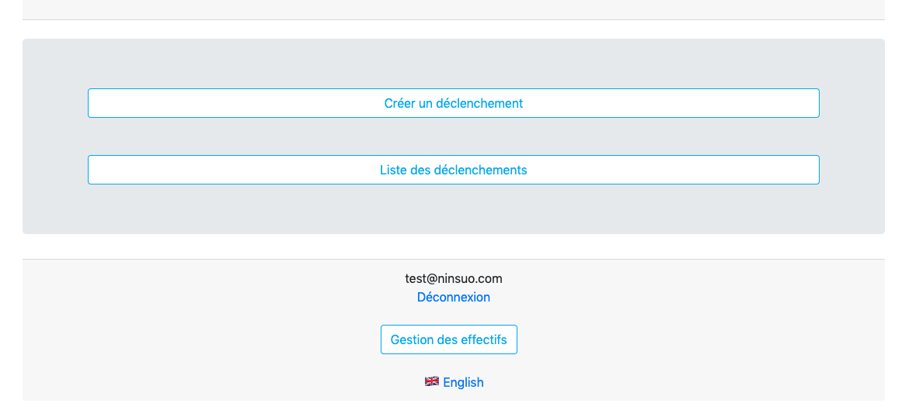

L'affichage est très large car l'application est optimisée pour être utilisable sur un smartphone.

Vous pouvez également aller dans "Gestion des effectifs" si vous souhaitez rajouter ou modifier les coordonnées ou les compétences d'un bénévole.

---

## Créer un déclenchement 

Vous pouvez envoyer vos déclenchements par deux moyens:

- Par SMS, pour les urgences dont les réponses rapides sont nécessaires, par exemple lors d'un incident (débordements manifs, explosion, attentat...) où des équipages sont nécessaires au plus vite.

- Par email, pour les recensements nécessaires à des activités plus lointaines, par exemple pour prévoir des ressources tous les soirs de la semaine suivante.


### Nom et type


Le nom du déclenchement est affiché dans la liste des déclenchements de votre unité locale, et vous permet de le repérer au premier coup d'oeil.

Le type de déclenchement dépend du contexte :

- Vert : phase d'informations à propos d'un risque ou d'un événement. Exemple: il y a un match OM / PSG à risque ce soir, du coup on demande à nos volontaires s'ils sont disponibles, au cas où.

- Orange : phase de préparation du recrutement, au niveau local (orange 1) ou départemental (orange 2). Exemple : une manifestation qui s'est mal passée le week-end dernier va se répéter ce week-end ; à ce moment là on prévoit des équipages à l'avance, avec une bonne certitude de les déclencher.

- Rouge : phase d'intervention / regroupement au point de rassemblement déterminé. Exemple : la manifestation "orange" préparée précédemment se déroule mal à nouveau, ou alors une explosion vient d'avoir lieu quelque part et des équipages sont immédiatement requis. 

Ces deux informations seront éditables ultérieurement dans le cas où l'incident pour lequel vous déclenchez devait évoluer.

### Audience

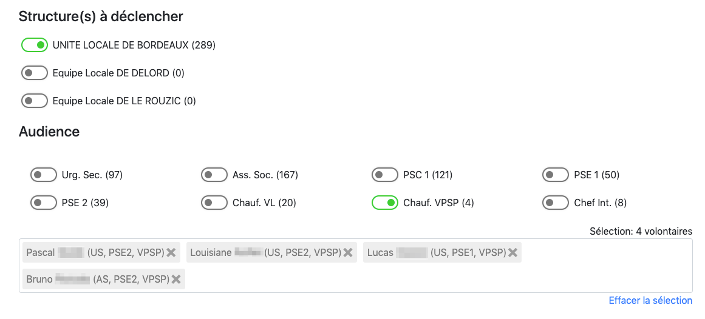

Cette seconde partie vous permet de sélectionner la liste des bénévoles que vous souhaitez contacter.

- Les structures à déclencher (seulement visible si votre structure est attachée à d'autres sous structures, par exemple une DT va avoir ses ULs en sous structures).

- Les compétences nécessaires (s'il s'agit d'un équipage de secours, il faudra 1 chauffeur VPSP, des PSE et éventuellement des PSC ; s'il s'agit d'un recensement pour des maraudes, on fera appel aux AS ; etc).

- Et éventuellement vous pouvez rajouter des personnes à contacter en tapant leur nom à la main, ou en supprimer en cliquant sur la croix située à droite de chaque bénévole.


### Message


Votre message peut contenir:
 
- une information
- une question ouverte (SMS uniquement)
- une question pour laquelle vous allez proposer une liste de choix possibles

Dans la plupart des cas, vous utiliserez ce dernier type de message car il permet de trier plus rapidement les réponses de votre audience.

Vous pouvez envoyer deux types de messages:

#### Par SMS

Pour les envois urgents uniquement.

Les SMS sont limités à 300 caractères pour des raisons de fiabilité et de coût. Plus un message est long, plus il coûte cher et moins il a de chances d'arriver rapidement.

#### Par email

Utilisez les emails pour tout autre déclenchement.


### Réponses


Utilisez le menu déroulant pour utiliser des modèles de réponses les plus courants

- "Oui / Non" pré-remplira "Oui" et "Non"
- "Dispo / Indispo" pré-remplira "Dispo" et "Indispo"
- "Jours de la semaine" pré-remplira "Lundi" ... "Dimanche"
- etc.

Si aucun modèle ne correspond à votre besoin, vous avez la possibilité de proposer jusque 9 choix de réponses personnalisés.

La dernière coche permet à un volontaire d'avoir la possibilité de répondre en donnant plusieurs choix (ex: lundi et mardi).

Chaque volontaire devra répondre par le code correspondant à la réponse qui lui convient, ou donner plusieurs codes séparés par un espace si vous avez coché la case "Les destinataires peuvent choisir plusieurs réponses".

### Autres options

Une dernière coche permet aux volontaires déclenchés de se géo-localiser entre eux. 


Lorsqu'un équipage est complet, envoyez un message aux bénévoles afin de donner l'emplacement du point de rassemblement, et cochez cette case afin que chaque membre puisse partager sa position et son numéro de téléphone.

### Prévisualisation

La prévisualisation vous montre le message tel qu'il sera envoyé à l'audience.


Nous vous indiquons le "coût du SMS" à titre informatif : les SMS coûtent cher (environ 4 centimes tous les 160 caractères), et plus ce multiple est élevé, plus le message est lent à arriver. Alors privilégiez des messages courts en cas d'urgence absolue.

Cliquez sur "Envoyer" afin d'envoyer votre message à l'audience sélectionnée.

---

## Liste des déclenchements


La liste des déclenchements est par défaut organisée par date de création décroissante, utilisez le menu déroulant afin d'organiser par couleur (vert/orange/rouge) ou par intitulé.

- Cliquez sur l'onglet "En cours" pour voir les déclenchements toujours ouverts.

- Cliquez sur l'onglet "Terminés" pour voir les déclenchement fermés.

- Cliquez sur le titre d'un déclenchement pour l'ouvrir

Pour des raisons techniques, pensez à fermer les déclenchements lorsqu'ils sont terminés (cela libèrera par exemple les préfixes utilisés dans les codes de réponse envoyés aux bénévoles) .

---

## Suivi d'un déclenchement

Lorsque vous créez ou ouvrez un déclenchement, vous arrivez sur la page de suivi

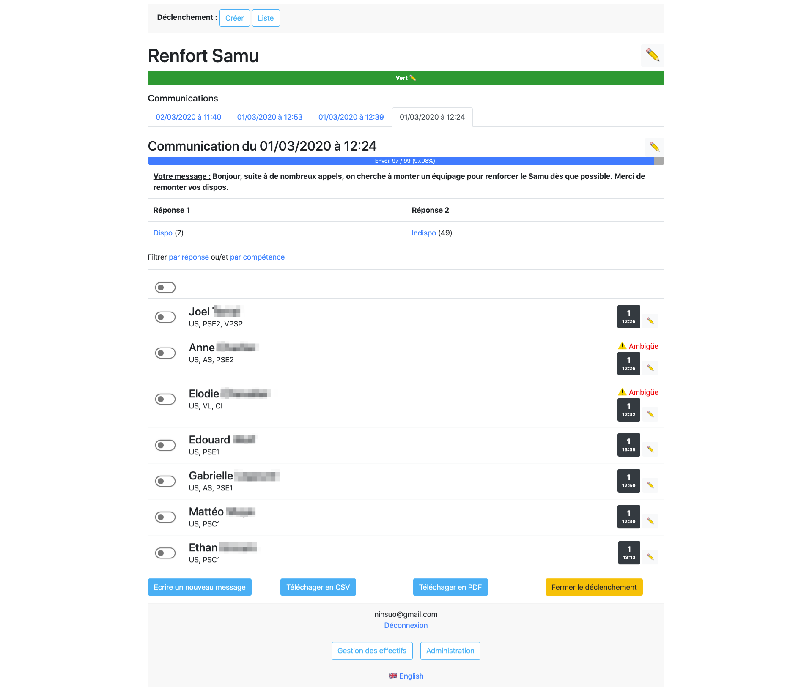

Cette page permet:
- d'afficher la liste des bénévoles déclenchés
- d'afficher leur réponses aux messages en temps réel
- de filtrer les bénévoles en fonction de leur réponse ou/et de leurs compétences
- d'envoyer un nouveau message à une sélection de bénévoles

### Naviguer entre les messages

Dans le cas où votre déclenchement contiendrait plusieurs communications, utilisez les onglets afin de passer de l'une à l'autre.


### Progression de l'envoi d'un message

Vous pouvez suivre l'avancement de l'envoi de ce message via la barre de progression:


Si la barre de progression ne va pas au bout, il est possible que certains volontaires n'aient pas de numéro de téléphone sur Pegass. Vous devrez alors leur demander de renseigner ces informations sur Gaia afin qu'ils deviennent déclenchables.

La barre indique l'envoi des messages par RedCall, mais ne grantit pas de leur arrivée à destination (téléphone éteint, délais opérateurs etc).

### Tableau de bord

Chaque ligne du tableau correspond à un volontaire à qui vous avez envoyé un message.

De gauche à droite:
- une case à cocher qui va permettre de sélectionner le volontaire
- son nom et ses compétences
- le numéro de la réponse qu'il a répondu au message
- l'heure à laquelle la réponse a été reçue
- la possibilité d'éditer manuellement la réponse

Une ligne qui contient le bénévole en noir mais aucune réponse signifie que celui-ci n'a pas encore reçu ou répondu au message.


Une ligne qui contient le bénévole en gris signifie que le message n'a pas pu lui être envoyé (il s'agissait d'un SMS mais le bénévole n'a pas de numéro de téléphone, ou il s'agissait d'un email et le bénévole n'en possède pas sur Pegass).


Une ligne qui contient le bénévole en noir et un chiffre signifie qu'il a correctement répondu au message.


Une réponse qui contient "Ambigüe" signfie que la réponse au message est valide, mais que le volontaire a probablement dit autre chose avec (ex: "A1 mais seulement jusqu'à 18h!") 


Une réponse qui contient "?" signifie que RedCall n'a pas pu interprêter la réponse renvoyée par le bénévole. Elle est du coup affichée en dessous de ses compétences.


### Editer les réponses

Les bénévoles reçoivent ce format de message:

```
CROIX-ROUGE à 16h40:
Bonjour, etes vous disponible (...) ?
A1: Oui
A2: Non
Pour répondre, saisir le code de votre choix.
```

Le préfixe (ici "A") permet à RedCall de supporter des déclenchements multiples au même moment. Si un autre déclenchement a lieu, ou si une autre question est posée, le préfixe deviendra "B" afin de savoir à quelle question rattacher la réponse.

Le numéro (ici "1" ou "2") correspond au numéro de la réponse.

Et pour que la réponse ne soit pas ambigüe, elle doit être soit A1, soit A2, pas autre chose.

Devant cette complexité, certains bénévoles vont seulement répondre "Non", ou bien "2", ou bien "Oui, mais seulement pendant 2h"

Du coup, le petit crayon à droite des réponses vous permet de changer la réponse d'un bénévole, afin de pouvoir par la suite utiliser les filtres.

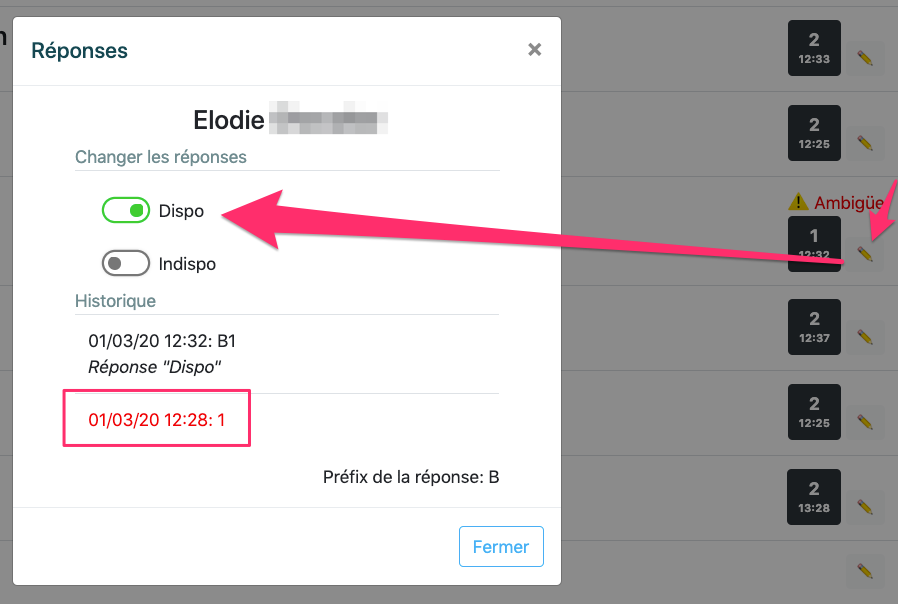

### Filtres

Il est possible de filtrer les lignes de ce tableau par réponse, afin, par exemple, de n'afficher que les bénévoles disponibles dans le cadre d'une opération. C'est également utile pour repérer les "mauvaises" réponses afin de les recatégoriser correctement.

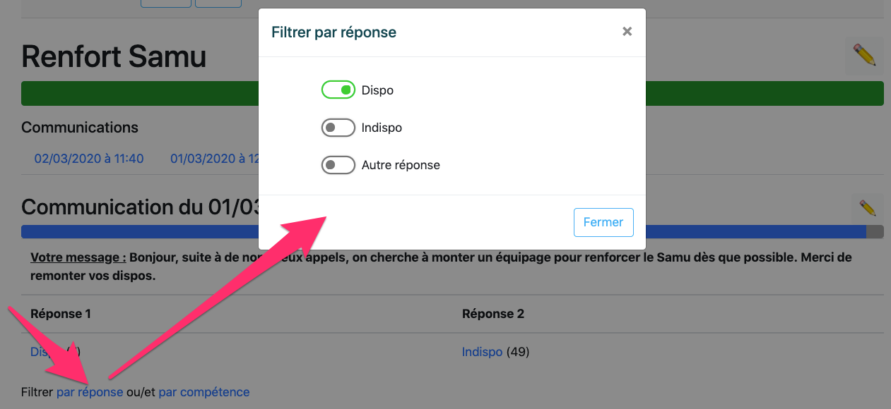

Vous pouvez cumuler le filtre par réponse avec le filtre par compétences, afin, par exemple, de ne filtrer que les chauffeurs VPSP qui sont disponibles.

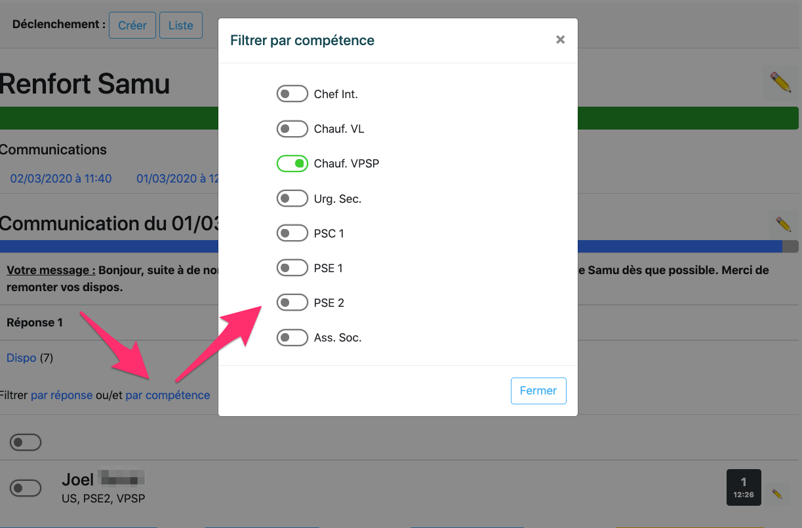

### Créer un nouveau message

Si vous souhaitez contacter les bénévoles disponibles (afin de leur envoyer leur point de rassemblement, ou ultérieurement un message de remerciment par exemple), appliquez les filtres que vous souhaitez et utilisez les coches à gauche afin de sélectionner des bénévoles.

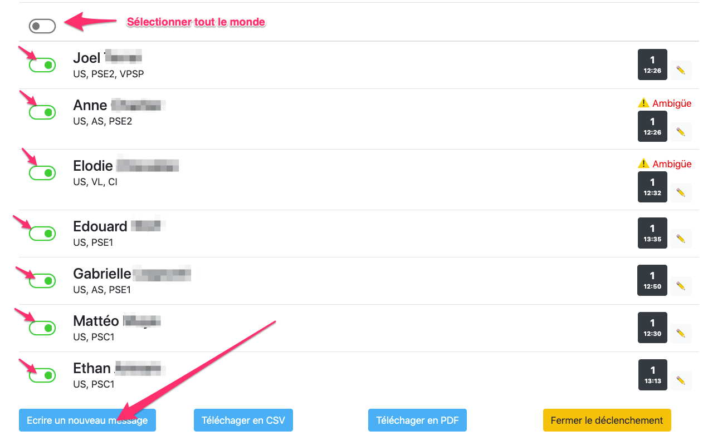

Cliquez sur "Ecrire un nouveau message" afin d'accéder au formulaire de déclenchement, avec la liste des bénévoles choisis présélectionnés. 

Une fois le message envoyé, un nouvel onglet de communication apparaîtra en haut de votre déclenchement.

### Téléchargements

De la même manière, après avoir sélectionné les volontaires, vous pouvez télécharger un fichier CSV ou un fichier PDF afin d'effectuer la remontées des équipages créés auprès de votre DT. 

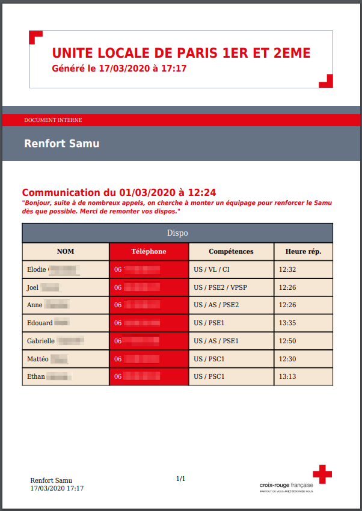

### Autres options

Vous pouvez changer le nom du déclenchement en cliquant sur le crayon situé à sa droite.

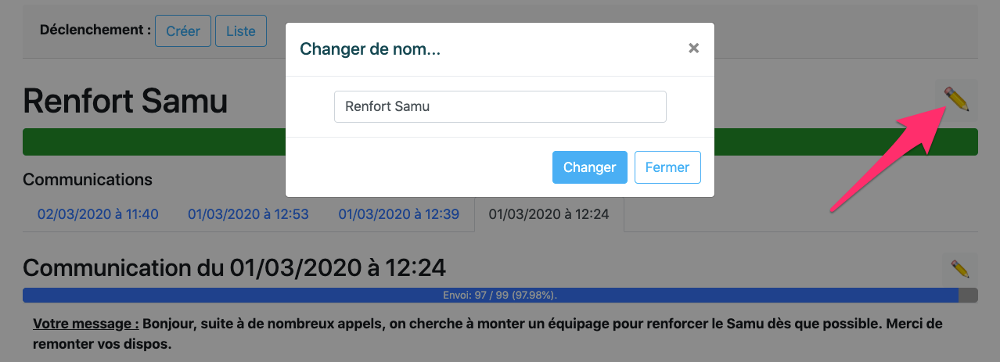

Vous pouvez changer le type de déclenchement en cliquant n'importe où sur la couleur (ici, verte).

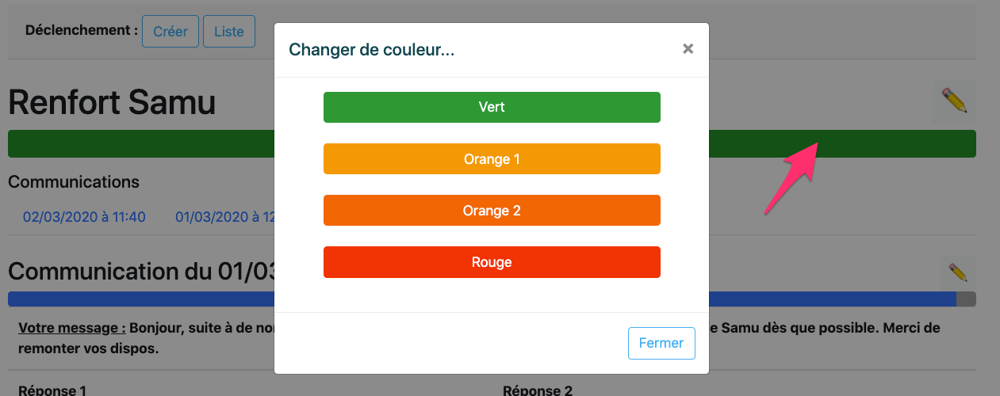

Vous pouvez renommer chacunes des communications, ce qui peut être très utile si vous devez gérer plusieurs équipages. Cela remplacera la date/heure du message affichée dans l'onglet par ce nouveau nom.

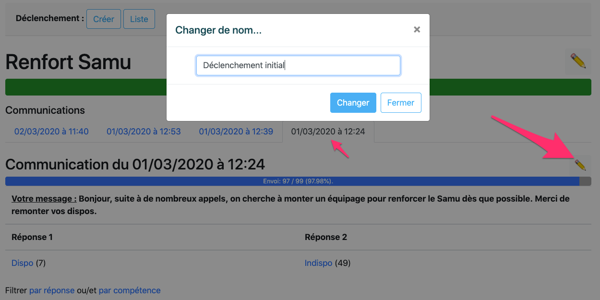

## Gestion des effectifs

La base de bénévoles provient de Pegass, elle est mise à jour automatiquement:

- 1 fois par semaine pour chaque structure afin de rajouter les nouveaux bénévoles et supprimer ceux qui ne sont plus actifs

- 1 fois par mois pour mettre à jour les coordonnées et les compétences d'un bénévole

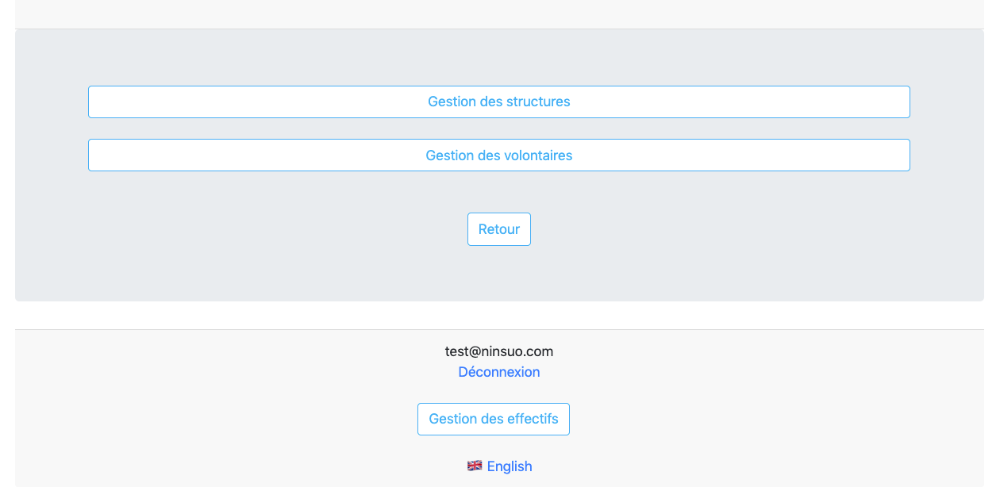

### Structures

La page de gestion des structures vous permet de:

- voir à quelle date votre structure a été mise à jour ou sera prochainement synchronisée avec Pegass (les dates sont au format UTC, comprendre à l'heure anglaise).

- vous pouvez forcer la mise à jour de votre structure si par exemple vous souhaitez intégrer un bénévole qui est arrivé, ou supprimer les bénévoles qui n'ont pas réglé leur cotisation.

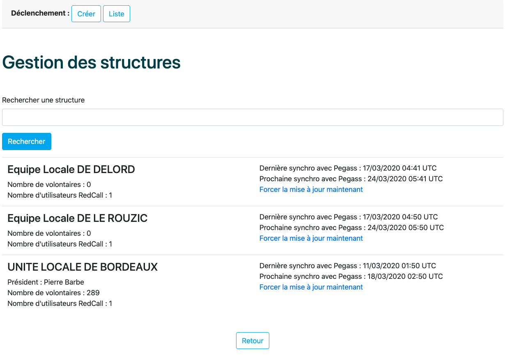

### Volontaires

Il faut savoir que les bénévoles sont importés de Pegass mais cela peut avoir plusieurs effets de bords :

Si un bénévole possède plusieurs numéros de téléphone, on récupère le premier de disponible dans l'ordre suivant:
- téléphone portable personnel
- téléphone fixe personnel (si c'est un n* de mobile)
- téléphone portable pro
- téléphone fixe pro (si c'est un n* de mobile)

Si un bénévole possède plusieurs emails, on récupère le premier de disponible dans l'ordre suivant:
- email personnel
- email professionel
- email croix-rouge

La page de gestion de volontaires vous permet donc de vérifier ou/et corriger d'éventuelles erreurs.


#### Actions

Sur chaque volontaire, vous pouvez effectuer les actions suivantes:


- Synchroniser avec Pegass : si un bénévole a récemment validé une formation (ex: PSE1) et que celle-ci a été saisie dans Pegass, vous aurez probablement envie de pouvoir déclencher ce volonaire en cas de besoin. Vous pouvez donc forcer une synchronisation avec Pegass avant le délai habituel de 30 jours.

- Mise à jour manuelle : si un bénévole se plaint de ne pas être déclenché, vous pouvez par exemple changer ses coordonnées (numéro de téléphone ou/et email). Vous pouvez également changer ses compétences si vous n'avez pas pu les mettre à jour sur Pegass.

- Geler le volontaire : cela vous permet de ne plus synchroniser un volontaire avec Pegass (c'est normalement fait tous les 30 jours). Un volontaire est automatiquement gelé si vous effectuez une mise à jour manuelle ce qui permet d'éviter que Pegass vienne écraser vos changements. Si le volontaire est déjà gelé, ce bouton est remplacé par "Dégeler", qui réautorise la synchronisation avec Pegass.

- Desactiver un volontaire : utile si un bénévole encore actif ne souhaite plus être déclenché et vous en fait la demande.

#### Ajouter un volontaire

Si vous le souhaitez, vous pouvez créer de nouveaux volontaires, qui ne sont pas sur Pegass, et qui seront rattachés à votre structures.

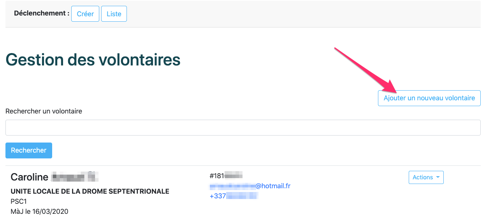 
